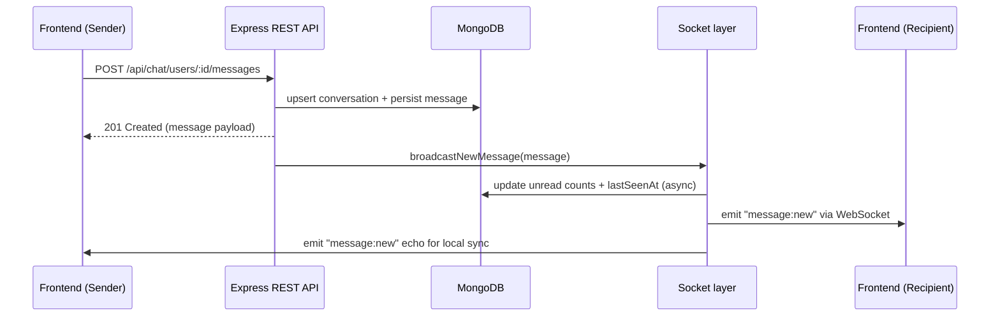
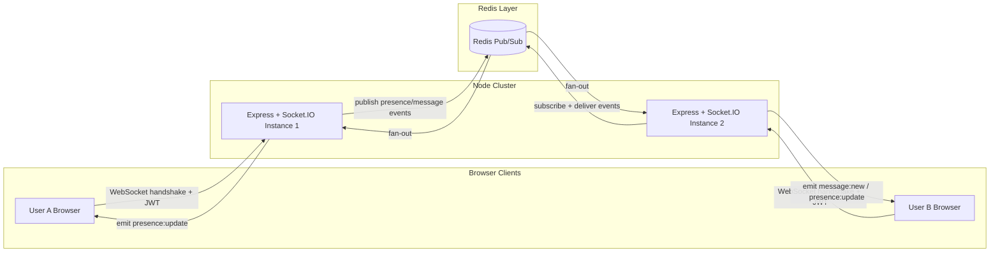

# CE Bootcamp Monorepo

A refreshed codebase for the CE Bootcamp portal. The project is now split into a React SPA front-end and an Express/MongoDB back-end. Both applications live side by side in this repository so you can develop, test, and deploy them independently.

## Project layout

```text
.
├── Frontend/    # React 18 single-page application
├── backend/     # Express API (migrated from the legacy EJS app)
└── .gitignore   # Shared ignore rules for both apps
```

### Prerequisites

- Node.js 18 or newer (the backend enforces this via `engines.node`)
- npm 9+ (ships with Node 18)
- A running MongoDB instance for the API (local or hosted)

## Documentation

- [`docs/realtime-chat.md`](docs/realtime-chat.md): End-to-end guide for the Redis-backed Socket.IO chat rollout, including env setup, verification steps, and deployment checklist.

## Quick start

### 1. Install dependencies

```bash
cd Frontend && npm install
cd ../backend && npm install
```

### 2. Configure environment variables

| App      | File to copy | Notes |
|----------|--------------|-------|
| Backend  | `backend/.env.example` → `backend/.env` | Update `MONGO_URI`, session secrets, mail credentials, and optional Google OAuth keys. |
| Frontend | (optional) create `Frontend/.env` | Set `REACT_APP_API_BASE_URL` if the API is not running on `http://localhost:8080`. |

> The backend will refuse to boot if `MONGO_URI`, `SESSION_SECRET`, or `JWT_SECRET` are missing.

### 3. Run the apps

In separate terminals:

```bash
# Frontend: CRA dev server (http://localhost:3000 by default)
cd Frontend
npm start
```

```bash
# Backend: Nodemon-powered development server
cd backend
npm run dev
```

The React app expects the API at `http://localhost:8080`. Adjust the `REACT_APP_API_BASE_URL` if you proxy through a different origin.

## Authentication & protected routes

- The backend issues HTTP-only JWT cookies on sign-in and supports Google OAuth just like the legacy EJS app.
- The React app keeps the session in sync via a global `AuthProvider`. Refreshing the browser will automatically refresh the current user state.
- `/batches` and `/profile` are protected routes; users are redirected to `auth/sign-in` if they are not authenticated.
- Once signed in, the navbar reveals quick links to **Batches**, **Edit Profile**, and a sign-out button. Profile updates (bio, socials, avatar) are available from the new `/profile` page.

## Available scripts

### Frontend

- `npm start`: Launches the CRA development server on port 3000.
- `npm run build`: Produces an optimized production bundle in `Frontend/build`.
- `npm test`: Runs the default Jest test suite.

### Backend

- `npm run dev`: Starts the API with `nodemon` (hot reloads on file changes).
- `npm start`: Runs the API with Node once compiled (no hot reload).

## Deployment notes

- Build the React application with `npm run build` and deploy the `Frontend/build` folder to your static host.
- Deploy the backend to your Node host (Docker, PM2, etc.) after supplying the production `.env` file. Make sure your MongoDB instance and mail/OAuth providers are reachable from the host environment.
- When deploying behind HTTPS, remember to update `FRONTEND_URL` and OAuth callback URLs inside the backend `.env` file.

## Troubleshooting

- **`MONGO_URI` errors at startup**: Confirm MongoDB is running and accessible from the backend container/host. The default points to `mongodb://127.0.0.1:27017/ce-bootcamp`.
- **CORS or cookie issues**: Ensure `FRONTEND_URL` in the backend `.env` matches the origin you use in the browser, including the correct port and protocol.
- **Outdated assets**: Delete `Frontend/build` before rebuilding if you see stale files being served by your static host.

## Next steps

- Configure CI to run `npm run build` (Frontend) and `npm test` or smoke checks for the backend on pull requests.
- Add a root-level task runner (e.g. `npm-run-all` or `turbo`) if you want single commands to orchestrate both apps. For now, each app is managed independently.

## System design & production deployment (Azure)

This section describes the high-level architecture, data flow, and recommended production deployment approach for the BranchBase monorepo. It includes diagrams and concrete, copy-pastable examples for provisioning and deploying the backend as a container into Azure App Service using Azure Container Registry (ACR).

### Architecture overview

At a glance:

- Frontend: React single-page app served as static files (S3/Blob/CDN or Azure Static Web Apps). The SPA calls the backend API for data and authentication.
- Backend: Express API packaged as a Docker image and run on Azure App Service (Web App for Containers) or any container host.
- Database: MongoDB (Atlas or self-hosted).
- Cache / realtime: Redis used for sessions and Socket.IO adapter (optional).
- Image storage: (optional) Azure Blob Storage for avatars and large binaries.
- CI/CD: GitHub Actions builds images and publishes to a registry (ACR or GHCR); App Service pulls images from registry.

Mermaid visual (simple component diagram):

```mermaid
flowchart LR
  subgraph Users
    U[Users / Frontend SPA]
  end
  subgraph Azure
    FE[Static Hosting / CDN]
    ACR[Azure Container Registry]
    AS[App Service (Containers)]
    Blob[Azure Blob Storage]
    KV[Azure Key Vault]
    Monitor[Azure Monitor &amp; Autoscale]
  end
  subgraph Data
    DB[MongoDB (Atlas / Self-hosted)]
    Redis[Redis Cache]
  end

  U --> FE
  FE --> AS
  AS --> DB
  AS --> Redis
  AS --> Blob
  AS --> KV
  ACR --> AS
  Monitor --> AS
```

Component responsibilities:

| Layer | Technology | Why it is used |
|-------|------------|----------------|
| Frontend delivery | Azure Static Web Apps or CDN | Serves the React build assets globally with edge caching. |
| API hosting | Azure App Service (Linux container) | Runs the Express backend in a managed environment with autoscale and health checks. |
| Container registry | Azure Container Registry | Stores versioned Docker images; integrates with App Service using managed identity. |
| Database | MongoDB Atlas (recommended) | Primary source of truth for user profiles, batches, conversations, etc. |
| Cache & realtime | Redis (Azure Cache for Redis or self-hosted) | Session store, rate limiting, Socket.IO adapter. |
| Object storage | Azure Blob Storage (optional) | Offloads heavy avatars/files from MongoDB for cheaper, scalable storage. |
| Secrets | Azure Key Vault (optional) | Centralized secret management with rotation and App Service referencing. |
| Monitoring | Azure Monitor & Application Insights | Metrics, logs, and autoscale rules. |

Deployment workflow visual:

```mermaid
sequenceDiagram
  participant Dev as Developer/GitHub Actions
  participant ACR as Azure Container Registry
  participant WebApp as Azure App Service
  participant MongoDB as MongoDB
  participant RedisCache as Redis
  participant BlobStore as Azure Blob Storage
  participant Users as Users

  Dev->>ACR: Build &amp; push image (branchbase-backend:TAG)
  WebApp->>ACR: Pull latest approved image
  WebApp->>MongoDB: Query/Update data
  WebApp->>RedisCache: Cache sessions, publish events
  WebApp->>BlobStore: Store/Retrieve avatar assets
  Users->>WebApp: HTTPS requests (API + WebSocket)
  WebApp-->>Users: Responses & realtime events
```

### Data flow (request example)

1. Browser loads static SPA from CDN/Static host.
2. SPA requests user state from Backend API at /api/me (cookie-based auth or bearer token).
3. Backend validates session/JWT, queries MongoDB (and Redis for ephemeral state), and returns user data with avatar URLs pointing to either App Service / Blob Storage.
4. For avatar uploads, the backend either uploads files to Blob Storage and returns blob URLs, or serves them directly from the database (not recommended at scale).

### Chat runtime architecture

Key pieces in the chat stack:
- `backend/src/controllers/chatController.js` owns REST endpoints that create conversations, persist messages, and drive read receipts.
- `backend/src/socket/index.js` wraps Socket.IO, authenticates clients with JWTs, and emits realtime updates for message delivery, presence, and read receipts.
- `backend/src/config/redis.js` provisions a shared Redis connection so Socket.IO instances can coordinate through the Redis adapter when you scale horizontally.
- `backend/src/jobs/messageNotificationScheduler.js` scans queued messages and sends deferred email notifications when recipients stay offline.

#### Message send and delivery (REST → realtime)



Highlights:
- REST writes remain the source of truth; Socket.IO only fans out events after MongoDB commits succeed.
- Presence and unread counts are recalculated on the server so each client receives consistent metadata.
- Clients may optimistically render sends, but the authoritative payload (IDs, timestamps, read state) flows through the realtime channel.

#### Socket presence, scaling, and Redis adapter



How this maps to code:
- `createSocketServer` authenticates sockets, joins each user to a private room (`user:{id}`), and wires up presence counters so the API can expose `isUserOnline`.
- When Redis credentials exist, the server duplicates the base Redis client to create the Socket.IO Redis adapter (`pubClient` and `subClient`), unlocking cross-instance fan-out.
- `broadcastNewMessage`, `broadcastConversationUpdate`, and `broadcastMessagesRead` target both participants by room ID, and the adapter ensures every instance relays the same payload.
- If Redis is unavailable, Socket.IO falls back to an in-memory adapter, so realtime still functions in single-instance development environments.

### Production deployment pattern (recommended)

1. Build a Docker image of the backend (the repo includes `backend/Dockerfile`).
2. Push the image to ACR (or GHCR). Use ACR for tighter Azure integration and easier managed identity usage.
3. Create an App Service (Web App for Containers) that pulls the image from ACR.
4. Configure App Service settings (environment variables, `WEBSITES_PORT=8080`, `WEBSITES_ENABLE_APP_SERVICE_STORAGE=false` if not using local storage, enable WebSockets).
5. Use a system-assigned managed identity for the Web App and grant it `AcrPull` on the ACR resource. Store secrets in Key Vault if required and reference them from App Service.
6. Configure health checks (`/socket/ping`) and enable autoscale rules via Azure Monitor.

### Example Azure CLI commands (PowerShell friendly)

Replace placeholders like `<RG>`, `<ACR_NAME>`, `<APP_NAME>`, `<LOCATION>`, and secret values with your own.
```powershell
# create resource group
az group create --name rg-branchbase-sea --location southeastasia

# create ACR (example name: branchbaseacr5785)
az acr create --resource-group rg-branchbase-sea --name branchbaseacr5785 --sku Standard --admin-enabled false

# build and push image to ACR (server-side build)
az acr build --registry branchbaseacr5785 --image branchbase-backend:latest --file backend/Dockerfile backend

# create App Service plan (Linux)
az appservice plan create --name plan-branchbase-prod --resource-group rg-branchbase-sea --is-linux --sku S1

# create webapp that will use container from ACR
az webapp create --resource-group rg-branchbase-sea --plan plan-branchbase-prod --name branchbase-backend --deployment-container-image-name branchbaseacr5785.azurecr.io/branchbase-backend:latest

# assign system-managed identity to the webapp
az webapp identity assign --name branchbase-backend --resource-group rg-branchbase-sea

# Grant AcrPull role to the webapp's managed identity on the ACR
$principalId = (az webapp identity show --name branchbase-backend --resource-group rg-branchbase-sea --query principalId -o tsv)
az role assignment create --assignee-object-id $principalId --role AcrPull --scope $(az acr show --name branchbaseacr5785 --resource-group rg-branchbase-sea --query id -o tsv)

# Set environment variables (example)
az webapp config appsettings set --resource-group rg-branchbase-sea --name branchbase-backend --settings MONGO_URI="<value>" SESSION_SECRET="<value>" JWT_SECRET="<value>" WEBSITES_PORT=8080 FRONTEND_URL="https://your-frontend.example"

# set health check path
az webapp config set --resource-group rg-branchbase-sea --name branchbase-backend --generic-configurations '{"healthCheckPath":"/socket/ping"}'

# enable logs (optional)
az webapp log config --name branchbase-backend --resource-group rg-branchbase-sea --docker-container-logging filesystem

# autoscale example: scale 1-3 instances based on CPU > 60%
az monitor autoscale create --resource-group rg-branchbase-sea --resource plan-branchbase-prod --name branchbase-autoscale --min-count 1 --max-count 3 --count 1
az monitor autoscale rule create --resource-group rg-branchbase-sea --autoscale-name branchbase-autoscale --scale out 1 --condition "Percentage CPU > 60 avg 5m"
az monitor autoscale rule create --resource-group rg-branchbase-sea --autoscale-name branchbase-autoscale --scale in 1 --condition "Percentage CPU < 30 avg 5m"
```

### Example GitHub Actions workflow (build -> push to ACR -> update Web App)

This example uses the Azure CLI to build in ACR and then updates the Web App to use the newly-pushed image tag. It assumes an Azure service principal is configured in GitHub Secrets as `AZURE_CREDENTIALS` and that `ACR_NAME` and `APP_NAME` are provided as secrets/vars.

```yaml
name: Build and deploy backend to ACR/App Service

on:
  push:
    branches: [ main ]

jobs:
  build-and-deploy:
    runs-on: ubuntu-latest
    steps:
      - name: Checkout
        uses: actions/checkout@v4

      - name: Login to Azure
        uses: azure/login@v1
        with:
          creds: ${{ secrets.AZURE_CREDENTIALS }}

      - name: Build & push image to ACR (server-side)
        run: |
          az acr build --registry ${{ secrets.ACR_NAME }} --image branchbase-backend:${{ github.sha }} --file backend/Dockerfile backend

      - name: Update Web App to use new image
        run: |
          ACR_LOGIN_SERVER=$(az acr show --name ${{ secrets.ACR_NAME }} --query loginServer -o tsv)
          az webapp config container set --name ${{ secrets.APP_NAME }} --resource-group ${{ secrets.RESOURCE_GROUP }} --docker-custom-image-name $ACR_LOGIN_SERVER/branchbase-backend:${{ github.sha }}

      - name: Restart webapp
        run: az webapp restart --name ${{ secrets.APP_NAME }} --resource-group ${{ secrets.RESOURCE_GROUP }}
```

Notes:
- If you prefer to build images in GitHub Actions and push to GHCR instead of ACR, replace the `az acr build` step with `docker/build-push-action@v4` and authenticate to GHCR with `GITHUB_TOKEN` or a PAT.
- For production, prefer using the App Service's managed identity to read secrets from Key Vault instead of storing secrets directly as app settings.

### Frontend deployment

The front-end build output is `Frontend/build/`. Host that folder on any static host or CDN. Azure Static Web Apps, Azure Blob Storage + CDN, or Netlify are all valid options.

### Troubleshooting & verification

- Check App Service logs via Portal or CLI: `az webapp log tail --resource-group <rg> --name <app>`.
- Confirm container image is present in ACR: `az acr repository show --name <acr> --repository branchbase-backend`.
- Health check: GET `https://<app-name>.azurewebsites.net/socket/ping`.
- If images or avatars do not load due to CORS, double-check `FRONTEND_URL` and Helmet/CORS middleware in `backend/src/app.js`.

## Where to look next

- `backend/README.md` contains backend-specific run instructions and Docker Compose dev instructions. Keep the backend README for low-level developer guidance; this root README is intended as a higher-level system and deployment guide.
- Consider adding a `deploy/` folder with the official GitHub Actions YAML and an ARM/Bicep template if you want fully repeatable infra-as-code.

---

If you'd like, I can also:

- Add the GitHub Actions workflow file to `.github/workflows/` and a minimal `deploy` script under `deploy/`.
- Create an ARM/Bicep template or Terraform module to provision the ACR + App Service and assign the roles automatically.

Tell me which of those you'd like me to implement next and I'll create the files and run a quick validation locally.
